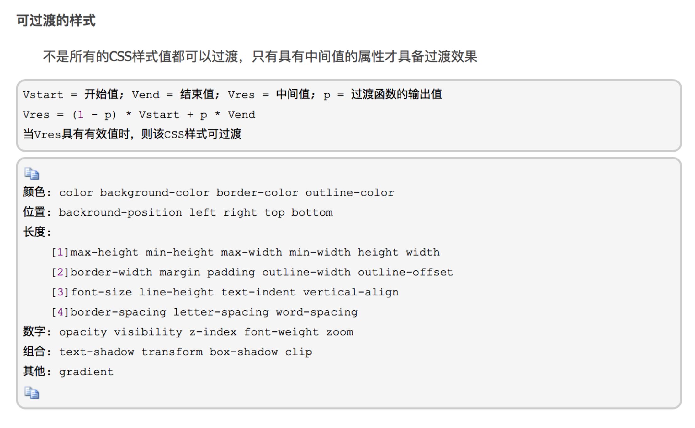
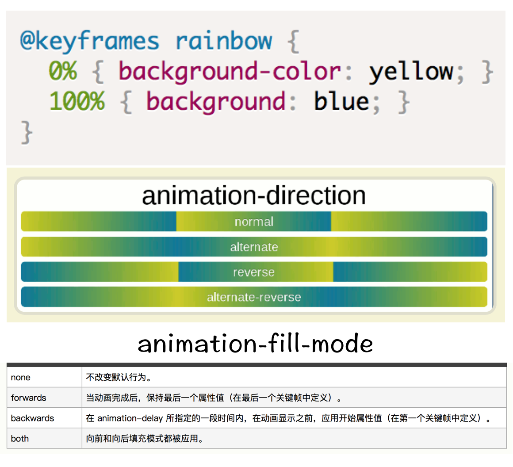
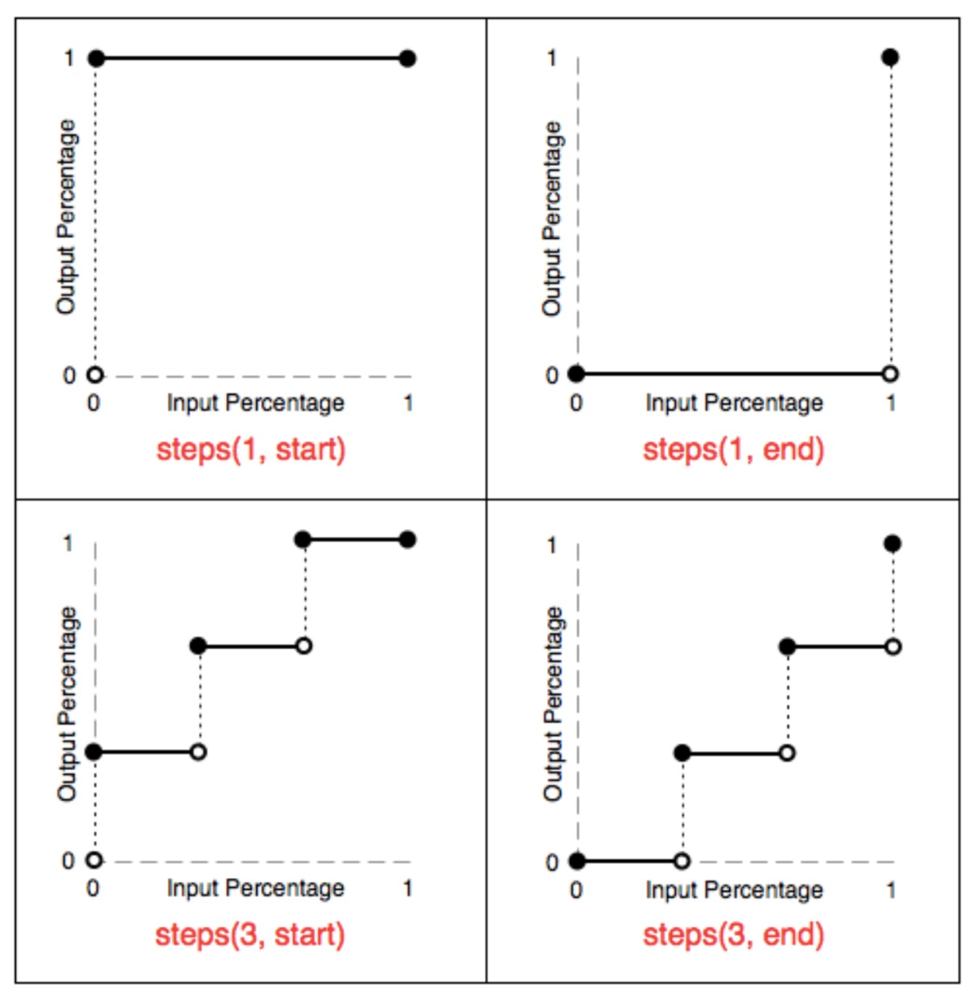

# React Animation

## Why and How? 开始前的仰望星空 :-P

### 为什么要为页面引入动画？

最直观的感觉肯定是动画会比较酷，引人注目。还有就是动画可以提高用户体验：例如在 APP 上，带有过渡效果的页面切换会比直接的页面跳转让人感觉舒服的多。

除了上面这两点，动画还有两个更重要的功能：

#### 1、增强交互。

在某些特定的情境下，动画能够帮助用户更好的理解产品。

用过 Mac 的朋友大概都知道，Mac 的窗口最小化的时候有一个“神奇效果”。然而这个效果不单单是为了神奇。
对于经常使用电脑、很懂怎么使用电脑的人，这个最小化的审美体验也是加分项了；然而对于那些不经常用电脑也不怎么会用电脑的人来说，这个效果其实是在向用户传达这样的信息：你的窗口最小化到了哪里，以及当你想再次打开它的时候，可以去哪里找到它。

#### 2、展示内容的新维度。

动画效果将时间作为一个展示维度引入到了页面当中：在有限的空间当中，允许部分内容随时间变化。

这里有个我很喜欢栗子：[webpack](https://doc.webpack-china.org)

通过动画切换，webpack 用简捷、还很酷的方式说明了：老子能打包的东西可多呢。

### 如何实现动画

本文将会涉及如下五个方法：

* CSS Animation
* JS Style
* React Motion
* Animated
* Velocity React

### 题外话

推荐一个在线的 [React VS Code IDE](https://stackblitz.com)，如果你不想构建新的 React app，可以用它检验代码的正确性。亲测好用!
另外，和本 markdown 文件平级的三个文件 index.html, index.js, style.css 可以拷贝至该在线 IDE 中查看运行效果。

## 方法一：CSS Animation

使用 CSS 实现动画有两个主要方式：transition 和 @keyframes & animation。

### transition 属性

就像下面这个栗子所示，transition 的作用在于它指定了状态变化需要的时间。配合 tranform/translate().rotate()，transition 可以完成众多神奇的动画效果～

```CSS
.transition{
  height: 43px;
  transition: 1s;
}

.transition:hover{
  height: 245px;
  transition: 2s;
}
```

但是使用 transition 有一点需要注意的：上面这段代码如果改成下面这样，transition 就不会生效。

```CSS
.transition{
  height: 43px;
  transition: 1s;
}

.transition:hover{
  height: auto;
  transition: 2s;
}
```

这是因为，不是所有 CSS 样式都可以过渡，只有具有中间值的属性才能使用 transition 来完成过渡效果。如果 height 设置为了 auto，它其实就变成了不可计算中间值的属性，自然也就没有过渡效果了。

还有一个很相似的例子，可以参见 index.js & style.css 的 animationBorderTest 元素。这个例子对 border 设置的动画效果也没有生效，而解决方案是在 .animationBorderTest 的 CSS 属性中添加 `border-style: solid;`。



transition 简单易用，但是它有几个很大的局限：
（1）transition需要事件触发，所以没法在网页加载时自动发生。
（2）transition是一次性的，不能重复发生，除非一再触发。
（3）transition只能定义开始状态和结束状态，不能定义中间状态，也就是说只有两个状态。
（4）一条 transition 规则，只能定义一个属性的变化，不能涉及多个属性：想定义一个元素的两个属性变化经历不同时间，是不可行的。

尽管如此，但也并不意味着此时就必须使用 JS 了—— CSS 还提供了 animation。

### @keyframes & animation

animation 是一个复合属性：

```CSS
div:hover {
  animation-name: rainbow;
  animation-duration: 1s;
  animation-timing-function: linear;
  animation-delay: 1s;
  animation-fill-mode: forwards;
  animation-direction: normal;
  animation-iteration-count: 3;
}
```

值得一题的几个属性：



还有就是 animation-timing-function，关于这个属性，这里有个比较有意思的栗子：[打字效果](http://dabblet.com/gist/1745856)。

看了这个例子我们可以想到，animation-timing-function 这个属性配合 background-position 可以帮助我们用纯 CSS 来做逐帧动画。

#### steps() 

steps() 第一个参数 number 为指定的间隔数，即把动画分为 n 步阶段性展示，第二个参数默认为 end，设置最后一步的状态，start 为结束时的状态，end 为开始时的状态。
steps 函数指定了一个阶跃函数，第一个参数指定了时间函数中的间隔数量（必须是正整数）；第二个参数可选，接受 start 和 end 两个值，指定在每个间隔的起点或是终点发生阶跃变化，默认为 end。



## 方法二：JS Style

JS 借助 CSS 类/样式的动态添加和删除添加动画，区别就是：开发者能拥有更多的逻辑控制权。
如果是在 React 中，大概就是用 JS 去修改 state.style 这样...

另外，介绍两个原生 JS 方法：

```JavaScript
Window.getComputedStyle()
style.getPropertyValue(property);
```
栗子：
```JavaScript
window.getComputedStyle(n, null).getPropertyValue("height");
```

### svg

可以参见 index.js 文件中的 svg 元素。这里值得一题的是属性：strock-dasharray

```CSS
@keyframes outline {
  0% {
    stroke-dashoffset: 400px;
  }
  100% {
    stroke-dashoffset: 0;
  }
}

#lineAB{
  animation: outline 3s ease-in-out;
  stroke-dasharray: 400px;
}
```
这个例子中，利用属性 stroke-dasharray 值的设定和 stroke-dashoffset 的 animation，做出了一个描边的效果。

在这里提到 svg 是因为有很多基于 svg 的优秀的 JS 类库能够帮助我们进行动画的快速开发。这里不一一列举，大家可以自行扩展。

## 方法三：React Motion

React Motion 是一个非常不错的开源项目。它的思想是你可以对 Motion 组件进行简单的样式设置，然后就可以在**回调函数**中通过这些值，享受动画带来的乐趣。

两枚栗子：
这个炒鸡好看：[水纹](https://chenglou.github.io/react-motion/demos/demo7-water-ripples/)
[TODO 列表](https://chenglou.github.io/react-motion/demos/demo3-todomvc-list-transition/)

React Motion 提供的 API
* Motion：基本元素
* StaggeredMotion：联动效果
* TransitionMotion：进出场效果
* spring：动画属性设置
* presets：预设值

具体的代码大家可以在 index.js 中找到，这里仅给出 JSX 代码：

``` JavaScript
<div className="App">
  <div style={styles.button} onClick={this.animate}>React Motion Animate</div>
  <Motion
    style={{ height: spring(this.state.height, {stiffness: 100, damping: 100}) }} // presets
    // 如果把我们要设置动画的物体想象成弹簧，stiffness相当于弹簧的强度，其影响的是弹簧回弹的速度，
    // 相同damping情况下，stiffness越大，回弹速度越快；
    // damping是弹簧的减震性，其影响的是弹簧的回弹次数，相同stiffness情况下，damping越大，回弹次数越少
  >
    {
      ({ height }) => // 回调函数
      <div style={Object.assign({}, styles.menu, { height } )}>
        <p style={styles.selection}>Selection 1</p >
        <p style={styles.selection}>Selection 2</p >
        <p style={styles.selection}>Selection 3</p >
        <p style={styles.selection}>Selection 4</p >
        <p style={styles.selection}>Selection 5</p >
        <p style={styles.selection}>Selection 6</p >
      </div>
    }
  </Motion>
</div>
<StaggeredMotion // 联动 （浅蓝色）
  defaultStyles={[{h: 0}, {h: 0}, {h: 0}]} // 初始值
  styles={prevInterpolatedStyles => prevInterpolatedStyles.map((_, i) => {
    return i === 0
      ? {h: spring(100, {stiffness: 50, damping: 10})} // ⬅️调节速度和回弹
      : {h: spring(prevInterpolatedStyles[i - 1].h)}
  })}>
  {interpolatingStyles =>
    <div style={{position: 'relative', overflow: 'hidden'}}>
      {interpolatingStyles.map((style, i) => // 回调函数
        <div key={i} style={{border: '1px solid', height: style.h, margin: '15px 15px 15px 0',
        width: 100, float: 'left', background: '#8DD4FD'}} />)
      }
    </div>
  }
</StaggeredMotion>
<TransitionMotion // 进出场（深蓝色）
  willLeave={this.willLeave} 
  styles={this.state.items.map(item => ({
    key: item.key,
    style: {width: spring(item.size), height: spring(item.size)},
  }))}>
  {interpolatedStyles =>
    // first render: a, b, c. Second: still a, b, c! Only last one's a, b. 
    <div>
      {interpolatedStyles.map(config => {
        return <div key={config.key} style={{...config.style, border: '1px solid',
        background: '#4788CC', marginTop: 10}} />
      })}
    </div>
  }
</TransitionMotion>
```

### React Motion 源码分析

源码分析三个划重点部分：

1、`import defaultRaf from 'raf';`：这里的 raf 其实是 requestAnimationFrame 的 shim。
  这里有个 [requestAnimationFrame 的演示](jsfiddle.net/paul/rjbGw/3/)。
  从演示里的代码中可以总结，requestAnimationFrame 该方法的要点是：调用自身以及一个状态更新函数。

  简单介绍下 requestAnimationFrame：
  >requestAnimationFrame是浏览器用于定时循环操作的一个接口，类似于setTimeout，主要用途是按帧对网页进行重绘。
  >设置这个API的目的是为了让各种网页动画效果（DOM动画、Canvas动画、SVG动画、WebGL动画）能够有一个统一的刷新机制，从而节省系统资源，提高系统性能，改善视觉效果。代码中使用这个API，就是告诉浏览器希望执行一个动画，让浏览器在下一个动画帧安排一次网页重绘。
  >requestAnimationFrame的优势，在于充分利用显示器的刷新机制，比较节省系统资源。显示器有固定的刷新频率（60Hz或75Hz），也就是说，每秒最多只能重绘60次或75次，requestAnimationFrame的基本思想就是与这个刷新频率保持同步，利用这个刷新频率进行页面重绘。此外，使用这个API，一旦页面不处于浏览器的当前标签，就会自动停止刷新。这就节省了CPU、GPU和电力。

2、Motion.js 中的 startAnimationIfNecessary 方法
  这个方法内部的代码逻辑和上面演示中的代码逻辑非常相似，都是会根据时间来计算当前 CSS 属性的值，最后再次调用自身，保证动画会继续渲染。

3、presets.js
  这个文件里是一系列的默认 spring 预设值。

#### 又一点题外话：使用 RxJS 制作动画

[这里是一个使用 RxJS 制作动画的栗子](https://codepen.io/davidkpiano/pen/55cb38a26b9166c41017c6512ea00209)

一点说明：RxJS 是一个库，它通过使用 observable 序列来编写异步和基于事件的程序。RxJS 不 是一个动画库，这是自然，但是使用可组合的、描述式的方式来处理伴随时间流动的数据，对于 ReactiveX 而言是一个核心概念，因此动画是一种能很好地展现这个技术的方式。

例如：
注册事件监听器的常规写法：

```JavaScript
var button = document.querySelector('button');
button.addEventListener('click', () => console.log('Clicked!'));
```

使用 RxJS 的话，创建一个 observable 来代替：

```JavaScript
var button = document.querySelector('button');
Rx.Observable.fromEvent(button, 'click')
  .subscribe(() => console.log('Clicked!'));
```

##方法四：Animated

Animated 基于 **React Native** 使用的动画库，它背后的思想是创建**声明式动画**，通过**传递配置对象**来控制动画。

同样的，在 index.js 中也有 Animated 的使用示例，这里仅给出 JSX 代码：

```JavaScript
<div style={{marginTop: 20}} >
  <div style={styles.button} onClick={this.animated}>Animated</div>
  <Animated.div
    style={{ opacity: this.animatedValue, marginLeft }}
  >
    <p>Thanks for your submission!</p >
  </Animated.div>
</div>
```

官网对 Animated 的介绍：
>The simplest workflow for creating an animation is to create an Animated.Value, hook it up to one or more style attributes of an animated component, and then drive updates via animations using Animated.timing().

### 源码分析

Animated 采用了 TypeScript，使用 TypeScript 的优势是在复杂项目中，可以为开发者提供变量提示和类型检查。

读源码的过程有点纠结，因为 Animated 的源码位于 react-native 的 libaries 里面，并且涉及到了 React Native。也就是读着读着，就读到了 Java 和 C++ 的代码。诶，还是代码经验少，被吓一跳～

这是因为 React Native 会涉及到 JS 和 Native 的交互，这个就说来话长了，给出两个不错的扩展阅读，大家自行学习吧。

推荐扩展阅读：
[ReactNative源码篇](https://github.com/guoxiaoxing/react-native/blob/master/doc/ReactNative源码篇/4ReactNative源码篇：渲染原理.md)
[Native & JavaScript 通信原理(CSDN)](blog.csdn.net/MegatronKings/article/details/51114278)

继续说 Animated，虽说涉及到 Native 的部分会使用 Java 和 C，但是单纯 Web 浏览器端的 Animated 动画，其核心还是：requestAnimationFrame。

核心代码位于 Animated/src/animations 下的几个文件。

多说一句，在 Animated 文件夹下可以看到文件 NativeAnimatedHelper，当代码运行在手机端，这个文件将完成 Animated 和 Native 的连接。
如果你看过了上面的推荐阅读，看到代码：`const NativeAnimatedModule = require('NativeModules').NativeAnimatedModule;` 会有种豁然开朗的感觉哈哈。

## 方法五：Velocity React

来自 index.js 的 JSX 示例：

```JavaScript
<div className="App">
  <div className="container">
    <input onChange={this.onChange} style={styles.input} />
    <div style={styles.letters}>
      {
        this.state.letters
      }
    </div>
  </div>
</div>
```

>在这个组件中，我们将 animation 的 opacity 设为 1，marginTop 设为 0，这些值代表着传入子组件的重写值，即当组件被创建时，组件的 opacity 会由初始的 0 变为 1，marginTop 会由初始的 100 变为 0，我们还设置了 500 ms 的持续时间，最后值得一提的是 runOnMount 属性，它的意思是在组件挂载或创建完后执行该动画。

### 源码分析

velocity-react 基于 velocity-animate，也就是核心代码都在 velocity-animate 库里面。velocity-react 只是 velocity-animate 基于 React 的扩展。

关于 velocity 说明一点，Velocity 引用了 jQuery，可以完美地同 jQuery 协作；实际上，Velocity.js 就模仿了 jQuery 的语法；当然，它也能独立地使用。

velocity-react 比较直白就不多说了，直接说说 Velocity.js 源码阅读我的一点收获。

首先，Velocity 也使用了 TypeScript。在工程的 package.json 中我们可以在 devDependencies 中找到 "typescript": "^2.7.1"。这个 typescript 可以将 ts 代码转化为 js。我们可以在文件目录中找到 velocity.js 文件，这个文件相当大，其实是 src 文件夹里面所有相关 ts 代码的总和。

如何生成 velocity.js 的呢？我们可以在工程中找到文件 grunt， grunt 是干嘛的？
>为了提高页面加载速度，增强用户体验，需要对代码进行合并、压缩，如果要保护自己的劳动，不想被别人无偿使用，还需要对代码进行混淆，最好部署到专门的服务器空间上去。这些工作，可以实现一键操作，这里切入了 grunt。相同功能的还有 gulp。

在 grunt 中的 ts.js 文件中：

``` JavaScript
module.exports = {
	options: {
		"fast": "never"
	},
	main: {
		"tsconfig": true,
		"files": {
			"build/velocity.js": ["src/app.ts"]
		}
	},
	test: {
		"tsconfig": "test/tsconfig.json",
		"files": {
			"test/test.js": ["test/src/app.ts"]
		}
	}
};
```
velocity.js 是基于 src/app.ts 生成的。

去看 app.ts，我们就会发现这个函数汇总了所有在 namespace：VelocityStatic 中定义的变量和方法。namespace 是一个 ts 的语法糖，作用基本就是在不同文件里扩展定义域。于是生成的 velocity.js 就包含了所有 ts 定义的方法。

As for 动画的实现嘛，就其实还是老一套的 window.requestAnimationFrame。最一开始，它是这样被触发的：

``` JavaScript
document.addEventListener("visibilitychange", function updateTicker(event?: Event) {
  // 浏览器标签页被隐藏或显示的时候会触发 visibilitychange 事件。
  let hidden = document.hidden;

  ticker = hidden ? rAFProxy : rAFShim;
  if (event) {
    setTimeout(tick, 2000);
  }
  tick();
});
```


