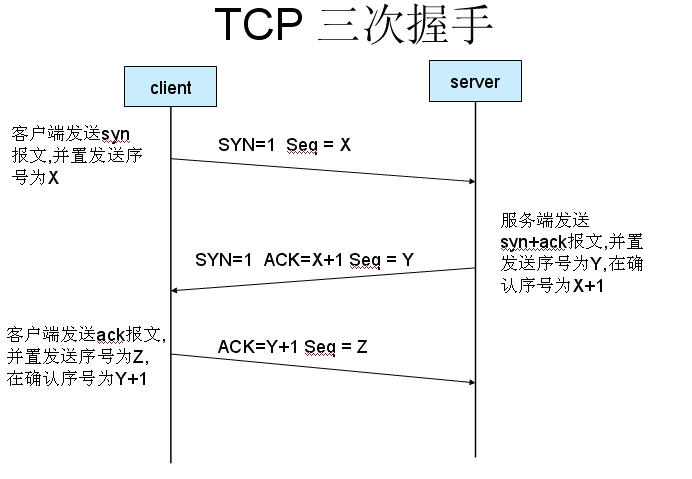
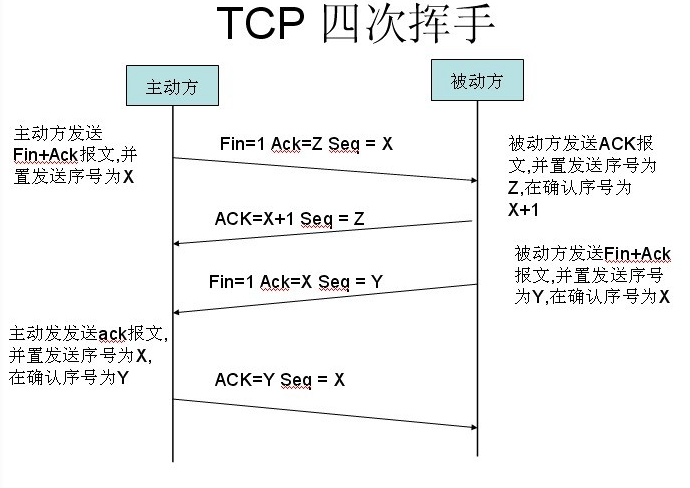

> * Title：前端面经不完全总结：NetWork 篇
> * Author：[EmilyQiRabbit 🙋 旺财](https://github.com/EmilyQiRabbit)
> * Links:
>      * [HTML篇](https://github.com/EmilyQiRabbit/CodingRepository/blob/master/InterviewSummery/html.md)
>      * [CSS篇](https://github.com/EmilyQiRabbit/CodingRepository/blob/master/InterviewSummery/css.md)
>      * [JS篇](https://github.com/EmilyQiRabbit/CodingRepository/blob/master/InterviewSummery/js.md)
>      * [NetWork篇](https://github.com/EmilyQiRabbit/CodingRepository/blob/master/InterviewSummery/network.md)

# 1、TCP/IP 五层模型的协议

这五层分别是：物理层 -> 数据链路层 -> 网络层 -> 传输层 -> 应用层

### 第一层：物理层

这一层，**数据的单位称为比特（bit）**。物理层负责物理链路连接，并传输 0 1 序列（高低电平）。常用的设备包括：中继器，集线器，网关等。

### 第二层：数据链路层

这一层，**数据的单位称为帧（frame）**。在物理层提供比特流服务的基础上，数据链路层将比特组装成帧，建立相邻结点之间的数据链路，并提供数据帧（Frame）在信道上无差错的传输。

数据链路层协议有许多种，但是有三个基本问题则是共同的，这三个问题就是：**封装成帧、透明传输、差错控制**。

关于差错控制，数据链路层广泛使用了**循环冗余检验 CRC（Cyclic Redundancy Check）**。

常用设备包括：网桥，交换机等。

### 第三层：网络层

这一层，**数据的单位称为数据包（packet）**。

网络层的任务就是**选择合适的网间路由和交换结点**，确保数据及时传送。网络层将数据链路层提供的帧组成数据包，包中封装有网络层包头，其中含有源站点和目的站点的网络地址。**有关路由的一切事情都在网络层处理**。

网络层还可以实现**拥塞控制**、**网际互连**等功能。

> 网络层协议的代表包括：
> IP（IP 协议的主要功能是：无连接的数据报传输、数据报路由选择）、IPX、RIP（*是一种动态路由选择协议，用于自治系统内的路由信息的传递*）、OSPF（*开放式最短路径优先 - Open Shortest Path First，是对链路状态路由协议的一种实现，隶属内部网关协议，运作于自治系统内部。采用算法：Dijkstra's algorithm，用来计算最短路径树*）、ARP（地址解析协议）等。

### 第四层：传输层

**TCP 的数据单元称为段（segments）而 UDP 协议的数据单元称为数据报（datagrams）**。

传输层协议的代表包括：面向连接的 TCP、连接的 UDP、SPX 等。

* UDP 是**无连接的**，使用尽最大努力交付，即不可靠交付，UDP **面向报文**，没有拥塞控制，因此网络出现的拥塞不会使源主机发送速率降低；它的优势则是首部开销小，且支持一对一、一对多、多对一、多对多的交互通信。

* TCP 是**面向连接**的传输层协议，TCP 连接只能是一对一的，它**提供可靠的交付服务**。也就是说通过 TCP 连接传送的数据，无差错、不丢失、不重复、并且按序到达。TCP 提供全双工通信，TCP 是面向字节流的，TCP 把应用程序交下来的数据块看成无结构的字节流，TCP不保证接收方应用程序收到的数据块和发送方应用程序所发出的数据块具有对应的大小关系（*例如，发送方应用程序交给发送方 TCP 共10个数据块，但接收方的 TCP 可能只用4个数据块就把收到的字节流交付给了上层的应用程序，但接收方应用程序收到的字节流必须和发送方应用程序发出的字节流完全一样*）。TCP 连接的端点叫做**套接字（socket）**，即：(IP地址: 端口号)，每一条 TCP 连接唯一地被通信两端的两个端点（即两个套接字）所确定。

### 第五层：应用层

应用层为操作系统或网络应用程序提供访问网络服务的接口。应用层协议的代表包括：

使用 TCP 协议：FTP（对应应用，文件传送）、HTTP（对应应用万维网）、TELNET（远程终端接入）、SMTP（电子邮件）。

使用 UDP 协议：DNS（名字转换）、TFTP（文件传送）。

# 2、URL 到回来全过程

# 3、TCP 三次握手/四次挥手

