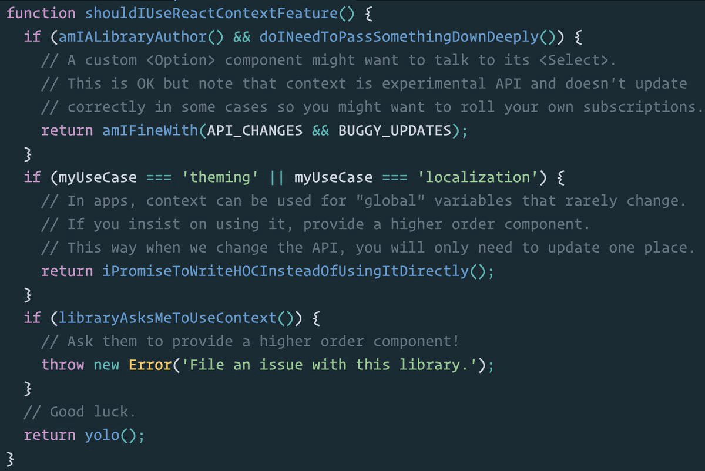

# React Context

*First，推荐网站：[React Online](https://stackblitz.com/edit/react-xueqcz)，可以在线测试你的 React 代码。*

**官网对 React Context 的解释：**

> Context provides a way to pass data through the component tree without having to pass props down manually at every level.

例如 Redux 的 Provider，就是通过 Context 提供了全局态的 store。Context 的核心是提供了一种：**生产者消费者模式**。

## 两种方式

旧版本：

```jsx
import React, { Component } from 'react';
import { render } from 'react-dom';
import Hello from './Hello';
import './style.css';
import PropTypes from 'prop-types';

class MiddleComponent extends React.Component {
  render () {
    return <ChildComponent />
  }
}

class ParentComponent extends React.Component {
  // 声明Context对象属性
  static childContextTypes = {
    propA: PropTypes.string,
    methodA: PropTypes.func
  }

  // 返回Context对象，方法名是约定好的
  getChildContext () {
    return {
      propA: 'propA',
      methodA: () => 'methodA'
    }
  }

  render () {
    return <MiddleComponent />
  }
}

class ChildComponent extends React.Component {
  // 声明需要使用的Context属性
  static contextTypes = {
    propA: PropTypes.string
  }

  render () {
    const {
      propA,
      methodA
    } = this.context

    console.log(`context1.propA = ${propA}`)
    console.log(`context1.methodA = ${methodA}`)

    return <div>Hello Context</div>
  }
}

export default ParentComponent
```

新版本：( React 需要更新至 16.4.1 版本 )

```jsx
import React from 'react'

const ThemeContext = React.createContext({})
 
class Title extends React.Component {
  render () {
    return (
      <ThemeContext.Consumer>
        {context => (
          <h4 style={ context }>
            { this.props.children }
          </h4>
        )}
      </ThemeContext.Consumer>
    );
  }
}

class Header extends React.Component {
  render () {
    return (
      <Title>Hello New React Context API</Title>
    );
  }
}

class ContextApp extends React.Component {
  render () {
    return (
      <ThemeContext.Provider value={{ 
        background: 'green', color: 'white', 
        marginTop: 10, display: 'inline-block', padding: 10
      }}>
        <Header/>
      </ThemeContext.Provider>
    );
  }
}

export default ContextApp
```

## 组件中可以获取 Context 的地方

```js
constructor(props, context)
// 生命周期方法
componentWillReceiveProps(nextProps, nextContext)
shouldComponentUpdate(nextProps, nextState, nextContext)
componetWillUpdate(nextProps, nextState, nextContext)
```

*以上部分节选自[张国钰的掘金博客](https://juejin.im/post/5a90e0545188257a63112977)*

## 使用 context 需要注意的

React App 的组件是树状结构，一层一层延伸，父子组件是一对多的线性依赖。随意的使用 Context 其实会破坏这种依赖关系，导致组件之间一些不必要的额外依赖，降低组件的复用性，进而可能会影响到App的可维护性。

另外，在 React issue 中，经常能找到 React.PureComponent、shouldComponentUpdate 与包含 Context 的库结合后引发的一些问题。
**原因在于 shouldComponentUpdate 会切断子树的 rerender，当 state 或 props 没有发生变化时，可能意外中断上层 context 传播。也就是当 shouldComponentUpdate 返回 false 时，context 的变化是无法被底层所感知的。**

### ShouldComponentUpdate 和 Context 如何一起工作？

需要全局模式科学上网：[原文链接](http://zhaozhiming.github.io/blog/2017/02/19/how-to-safely-use-react-context-zh-cn/)

* Context 正确的打开方式是：Context 不应该改变，它应该不可变

* 因此组件应该在其构造时只接收 context 一次

> 或者，为了使其不同，我们不应该直接把 state 保存到 context 中，取而代之，我们应该像依赖注入系统一样使用 conext。

### 通过基于 context 的依赖注入来和变更进行交流

精简版代码：

```js
// Theme 组件存储当前的主题状态，并允许组件订阅将来变化（的数据）
class Theme {
  constructor(color) {
    this.color = color
    this.subscriptions = []
  }

  setColor(color) {
    this.color = color
    this.subscriptions.forEach(f => f())
  }

  subscribe(f) {
    this.subscriptions.push(f)
  }
}

class ThemeProvider extends React.Component {
  constructor(p, c) {
    super(p, c)
    // 主题提供者在它的整个生命周期中使用同样的主题对象
    this.theme = new Theme(this.props.color)
  }

  // 必要时更新主题，更新的内容会传播给订阅的主键
  componentWillReceiveProps(next) {
    this.theme.setColor(next.color)
  }

  getChildContext() {
    return {theme: this.theme}
  }

  render() {
    return <div>{this.props.children}</div>
  }
}
ThemeProvider.childContextTypes = {
  theme: React.PropTypes.object
}

class ThemedText extends React.Component {
  componentDidMount() {
    // 订阅未来改变的主题
    this.context.theme.subscribe(() => this.forceUpdate())
  }
  render() {
    return <div style=>
      {this.props.children}
    </div>
  }
}
ThemedText.contextTypes = {
  theme: React.PropTypes.object
}
```

完整版代码：

```js
const TODOS = ["Get coffee", "Eat cookies"]

class TodoList extends React.PureComponent {
  render() {
    return (<ul>
      {this.props.todos.map(todo => 
        <li key={todo}><ThemedText>{todo}</ThemedText></li>
      )}
    </ul>)
  }
}

class App extends React.Component {
  constructor(p, c) {
    super(p, c)
    this.state = { color: "blue" } 
  }

  render() {
    return <ThemeProvider color={this.state.color}>
      <button onClick={this.makeRed.bind(this)}>
      	<ThemedText>Red please!</ThemedText>
      </button>
      <TodoList todos={TODOS} />
    </ThemeProvider>
  }
  
  makeRed() {
    this.setState({ color: "red" })
  }
}

class Theme {
  constructor(color) {
    this.color = color
    this.subscriptions = []
  }
  
  setColor(color) {
    this.color = color
    this.subscriptions.forEach(f => f())
  }

  subscribe(f) {
    this.subscriptions.push(f)
  }
}

class ThemeProvider extends React.Component {
  constructor(s, c) {
    super(s, c)
    this.theme = new Theme(this.props.color)
  }

  componentWillReceiveProps(next) {
    this.theme.setColor(next.color)
  }

  getChildContext() {
    return {theme: this.theme}
  }

  render() {
    return <div>{this.props.children}</div>
  }
}
ThemeProvider.childContextTypes = {
  theme: React.PropTypes.object
}

class ThemedText extends React.Component {
  componentDidMount() {
    this.context.theme.subscribe(() => this.forceUpdate())
  }
  render() {
    return <div style={{color: this.context.theme.color}}>
      {this.props.children}
    </div>
  }
}
ThemedText.contextTypes = {
  theme: React.PropTypes.object
}

ReactDOM.render(
  <App />,
  document.getElementById("container")
)
```

> 虽然我们的 ThemeProvider 的实现变得更复杂了，它创建了一个Theme 对象来保持了我们主题的状态，Theme对象同时也是一个事件发射器，这可以让像 ThemeText 一样的组件来订阅未来的变化，Theme 对象通过 ThemeProvider 在组件树中传递。context 仍然是用来做这个的，但只有刚开始的时候传递了 context，后面的更新都通过 Theme 自己来传播，并没有重新创建一个 context。

## Context 可能有的坑

* context 相当于一个全局变量，难以追溯数据源，很难找到是在哪个地方中对 context 进行了更新。

* 组件中过分依赖 context，会使组件耦合度提高，既不利于组件复用，也不利于组件测试。

* 当 props 改变或是 setState 被调用，getChildContext 也会被调用，生成新的 context，但 shouldComponentUpdate 返回的 false 会 block 住 context，导致没有更新。

Dan Abramov 给出的明智的使用方法是：



## 官方文档解析

### 何时使用 Context?

Context 的最佳用途是和字组件共享某些「全局变量」。

另外，特别标明：不要仅仅为了避免「个别组件、不多级别」的 prop 传递而使用 context。它真正的用武之地是「跨多级、多组件」的数据共享。

### 如何更新 context

官方推荐的的方法是，在 context 中同时传递一个方法，允许子组件对 context 进行修改。

```jsx
export const ThemeContext = React.createContext({
  theme: themes.dark,
  toggleTheme: () => {},
});
```

子组件中：

```jsx
import {ThemeContext} from './theme-context';

function ThemeTogglerButton() {
  return (
    <ThemeContext.Consumer>
      {({theme, toggleTheme}) => (
        <button
          onClick={toggleTheme}
          style={{backgroundColor: theme.background}}>
          Toggle Theme
        </button>
      )}
    </ThemeContext.Consumer>
  );
}

export default ThemeTogglerButton;
```

父组件中：

```jsx
import {ThemeContext, themes} from './theme-context';
import ThemeTogglerButton from './theme-toggler-button';

class App extends React.Component {
  constructor(props) {
    super(props);

    this.toggleTheme = () => {
      this.setState(state => ({
        theme:
          state.theme === themes.dark
            ? themes.light
            : themes.dark,
      }));
    };

    this.state = {
      theme: themes.light,
      toggleTheme: this.toggleTheme,
    };
  }

  render() {
    return (
      <ThemeContext.Provider value={this.state}>
        <Content />
      </ThemeContext.Provider>
    );
  }
}

function Content() {
  return (
    <div>
      <ThemeTogglerButton />
    </div>
  );
}

ReactDOM.render(<App />, document.root);
```

### 如何 "消费" 多个 Context

```jsx
// createContext 的参数是 context 的默认值
const ThemeContext = React.createContext('light');

const UserContext = React.createContext({
  name: 'Guest',
});

class App extends React.Component {
  render() {
    const {signedInUser, theme} = this.props;

    // 这里提供 context 的初始化值
    return (
      <ThemeContext.Provider value={theme}>
        <UserContext.Provider value={signedInUser}>
          <Layout />
        </UserContext.Provider>
      </ThemeContext.Provider>
    );
  }
}

function Layout() {
  return (
    <div>
      <Sidebar />
      <Content />
    </div>
  );
}

function Content() {
  return (
    <ThemeContext.Consumer>
      {theme => (
        <UserContext.Consumer>
          {user => (
            <ProfilePage user={user} theme={theme} />
          )}
        </UserContext.Consumer>
      )}
    </ThemeContext.Consumer>
  );
}
```

### 利用高阶组件 HOC（即 higher-order component，高阶组件）使用 Context

高阶组件的创建：

```jsx
const ThemeContext = React.createContext('light');

export function withTheme(Component) {
  // withTheme 接受一个组件作为参数，并返回另一个又被包了一层的组件
  return function ThemedComponent(props) {
    return (
      <ThemeContext.Consumer>
        {theme => <Component {...props} theme={theme} />}
      </ThemeContext.Consumer>
    );
  };
}
```

使用：

```jsx
function Button({theme, ...rest}) {
  return <button className={theme} {...rest} />;
}

const ThemedButton = withTheme(Button);
```

### Context Consumers 可以使用 Forwarding Refs 获取上级组件的 refs

父组件——提供 ref：

```jsx
import FancyButton from './fancy-button';

const ref = React.createRef();

<FancyButton ref={ref} onClick={handleClick}>
  Click me!
</FancyButton>;
```

子组件：

```jsx
class FancyButton extends React.Component {
  focus() {
    // ...
  }

  // ...
}

export default React.forwardRef((props, ref) => (
  <ThemeContext.Consumer>
    {theme => (
      <FancyButton {...props} theme={theme} ref={ref} />
    )}
  </ThemeContext.Consumer>
));
```

## 源码解析

定义部分非常简单，在文件 ReactContext.js 的方法 createContext 中：

```ts
const context: ReactContext<T> = {
  $$typeof: REACT_CONTEXT_TYPE,
  _calculateChangedBits: calculateChangedBits,
  _defaultValue: defaultValue,
  _currentValue: defaultValue,
  // As a workaround to support multiple concurrent renderers, we categorize
  // some renderers as primary and others as secondary. We only expect
  // there to be two concurrent renderers at most: React Native (primary) and
  // Fabric (secondary); React DOM (primary) and React ART (secondary).
  // Secondary renderers store their context values on separate fields.
  _currentValue2: defaultValue,
  _changedBits: 0,
  _changedBits2: 0,
  // These are circular
  Provider: (null: any),
  Consumer: (null: any),
};

context.Provider = {
  $$typeof: REACT_PROVIDER_TYPE,
  _context: context,
};
context.Consumer = context;

...

return context
```

MD挖不下去、看不懂了 #@_@# ...
还求大佬指点～


