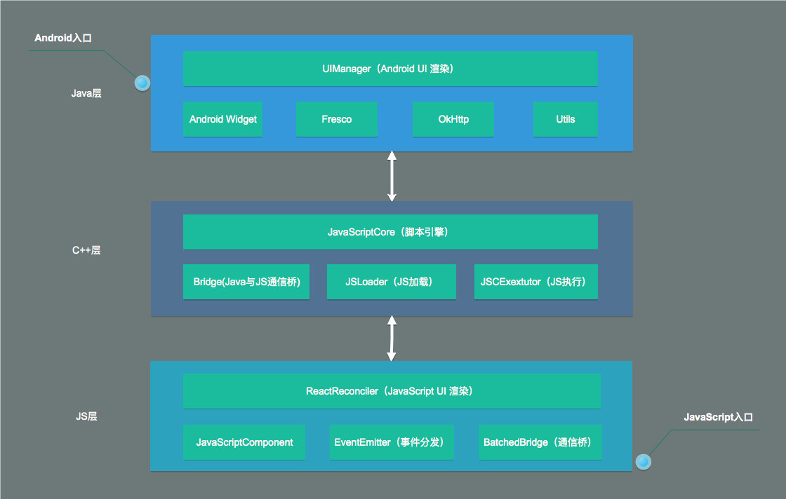
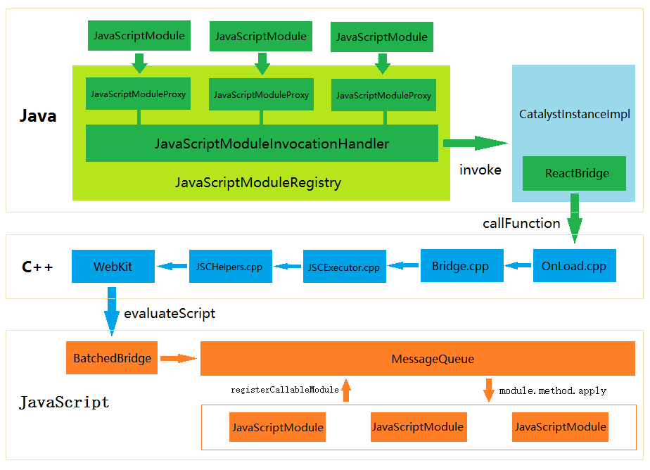

长文...还在持续生长中.....

# 一、ReactNative 概览与基础类

## ReactNative 是做什么的？

> React Native lets you build mobile apps using only JavaScript. It uses the same design as React, letting you compose a rich mobile UI from declarative components.

React Native 允许开发者使用 JavaScript 和 React 来构建 APP！并且，用 Native 构建起来的 APP 就是和使用原生语言开发一样的 APP，并不是什么 h5 嵌入到 APP 中这样的模式。

## ReactNative 源码概览

ReactNative 最核心的实现是基于 c, c++ 实现的，作为原生应用和 JS 之间的桥梁，负责两边的通信以及对 JS 的解析。

ReactNative 源码的框架大致如下：


## 几个重要的类

### 1、ReactContext

>ReactContext继承于ContextWrapper，也就是说它和Android中的Context是一个概念，是整个应用的上下文。那么什么是上下文呢，我们知道Android的应用模型是基于组件的应用设计模式， 组件的运行需要完整的运行环境，这种运行环境便是应用的上下文。

### 2、ReactInstanceManager

ReactInstanceManager 是 ReactNative 应用**总的管理类**：负责创建 ReactContext、CatalystInstance 等类，解析 ReactPackage 生成映射表，并且配合 ReactRootView 管理 View 的创建与生命周期等功能。

### 3、CatalystInstance

CatalystInstance 是 ReactNative 应用 Java 层、C++ 层、JS 层**通信总管理类**，总管Java 层、JS 层核心 Module 映射表与回调，三端通信的入口与桥梁。

### 4、NativeToJsBridge/JsToNativeBridge

NativeToJsBridge：是 Java 调用 JS 的桥梁，用来调用 JS Module，回调 Java。
JsToNativeBridge：是 JS 调用 Java 的桥梁，用来调用 Java Module。

### 5、JavaScriptModule/NativeModule

JavaScriptModule 是 JS Module，负责 JS 到 Java 的映射调用格式声明，由 CatalystInstance 统一管理。
NativeModule 是 Java Module，负责 Java 到 Js 的映射调用格式声明，由 CatalystInstance 统一管理。

### 6、JavascriptModuleRegistry

JavascriptModuleRegistry 是 JS Module 映射表，NativeModuleRegistry 是 Java Module 映射表。

# 二、JS & Native // Java & C++ // JS & C++ 交互概述

## 几个和交互相关的重要概念：

JavaScriptModule：这是一个接口，JS Module都会继承此接口，它表示在 JS 层会有一个相同名字的 js 文件，该 js 文件实现了该接口定义的方法，JavaScriptModuleRegistry 会利用动态代理将这个接口生成代理类，并通过 C++ 传递给 JS 层，进而调用 JS 层的方法。

JavaScriptModuleRegistration：用来描述 JavaScriptModule 的相关信息，它利用反射获取接口里定义的 Method。

JavaScriptModuleRegistry：JS Module **注册表**，内部维护了一个 HashMap：HashMap<Class<? extends JavaScriptModule>, JavaScriptModuleRegistration> mModuleRegistrations，JavaScriptModuleRegistry 利用动态代理生成接口 JavaScriptModule 对应的代理类，再通过 C++ 传递到 JS 层，从而调用 JS 层的方法。


NativeModule：是一个接口，实现了该接口则可以被 JS 层调用，我们在为 JS 层提供 Java API 时通常会继承 BaseJavaModule/ReactContextBaseJavaModule，这两个类就实现了 NativeModule 接口。

ModuleHolder：NativeModule的一个Holder类，可以实现NativeModule的懒加载。

NativeModuleRegistry：Java Module 注册表，内部持有 Map：Map<Class<? extends NativeModule>, ModuleHolder> mModules，NativeModuleRegistry 可以遍历并返回 Java Module 供调用者使用。


## JS & Native

执行 Native 代码的抽象类是 ExecutorDelegate，执行 JS 代码的抽象类是 JSExecutor。

其中，**ExecutorDelegate** 在 Executor.h 中定义，由 JsToNativeBridge 实现，该抽象类用于 JS 代码调用 Native 代码。
**JSExecutor** 也在 Executor.h 中定义，是用来执行 JS 代码的。执行代码的命令是通过 JS 层的 BatchedBridge 传递过来的。

## Java & C++

Java 调用 C/C++，需要用到 Java 中的 JNI（Java Native Interface）。JNI 通过动态注册的方式注册 Native 函数。

>JNI 动态注册
>动态注册允许你提供一个函数映射表，提供给虚拟机，这样虚拟机就可以根据函数映射表来调用相应的函数。

## JS & C++

RN 解析 JS 用的是 Webkit 的脚本引擎 JavaScriptCore，JavaScriptCore 负责 JS 的解释与执行。

>Webkit是一个开源的浏览器引擎，它包括一个网页排版渲染引擎 WebCore 与一个**脚本引擎 JavaScriptCore**。

### C++ 调用 JavaScript

#### step 1. 获取 Global 全局对象

``` 
JSGlobalContextRef context = JSGlobalContextCreate(NULL);
JSObjectRef global = JSContextGetGlobalObject(ctx); 
```

#### step 2. 获取 JavaScript 的全局变量、全局函数或者全局复杂对象，并完成调用。

下面这段代码就涉及到了很多 C++ 与 JS 交互的关键方法，比如 JSStringCreateWithUTF8CString、JSValueToObject 等等。

``` Java
//获取全局变量
JSStringRef varName = JSStringCreateWithUTF8CString("JavaScript变量名");
JSValueRef var = JSObjectGetProperty(ctx, globalObj, varName,NULL); JSStringRelease(varName);
//转化为C++类型
int n = JSValueToNumber(ctx, var, NULL);

//获取全局函数
JSStringRef funcName = JSStringCreateWithUTF8CString("JavaScript函数名");
JSValueRef func = JSObjectGetProperty(ctx, globalObj, funcName,NULL); JSStringRelease(funcName);
//装换为函数对象
JSObjectRef funcObject = JSValueToObject(ctx,func, NULL);
//组织参数,将两个数值1和2作为两个参数
JSValueRef args[2];
args[0] = JSValueMakeNumber(ctx, 1);
args[1] = JSValueMakeNumber(ctx, 2);
//调用函数
JSValueRef returnValue = JSObjectCallAsFunction(ctx, funcObject,NULL, 2, args, NULL);
//处理返回值
int ret = JSValueToNumber(ctx, returnValue, NULL);

//获取复杂的对象
JSStringRef objName=JSStringCreateWithUTF8CString("JavaScript复杂对象名");
JSValueRef obj = JSObjectGetProperty(ctx, globalObj, objName,NULL); JSStringRelease(objName);
//装换为对象
JSObjectRef object = JSValueToObject(ctx,obj, NULL);
//获取对象的方法
JSStringRef funcObjName =JSStringCreateWithUTF8CString("JavaScript复杂对象的方法");
JSValueRef objFunc = JSObjectGetProperty(ctx, object, funcObjName,NULL); JSStringRelease(funcObjName);
//调用复杂对象的方法,这里省略了参数和返回值
JSObjectCallAsFunction(ctx, objFunc, NULL, 0, 0, NULL);
```

### JavaScript 调用 C++

通过方法 JSObjectSetProperty 将在 c++ 中新建的 JavaScript 类对象注入到 JavaScript 的全局对象中，在 JS 中就可以使用了。

# 三、详述 Native 与 Javascript 通信

[节选自 CSDN 博客：Native 与 Javascript 通信原理](https://blog.csdn.net/MegatronKings/article/details/51114278)

通信模型框架：

**Java  <-->  C++  <-->  JavaScript**

可见，在 RN 中，C++ 作为桥梁，在 Java 和 JS 之间进行消息的传递。

## 1、Java 层

**一点说明：在代码中，注释了敲黑板的地方，都是重点哦！**

### JavaScriptModule

React-Native 实现了一些组件，比如按键、触摸等等，所有的组件都必须继承 JavaScriptModule（这是 Java 写的）接口标准。JavaScriptModule 位于 com.facebook.react.bridge。

关于 JavaScriptModule 官方给出需要注意的内容包括：

> 1.Interface denoting that a class is the interface to a module with the same name in JS. Calling functions on this interface will result in corresponding methods in JS being called.

在 JavaScriptModule 定义的接口和 JS 中的接口一一对应，调用 JavaScriptModule 接口函数将会导致 JS 中的同名函数被调用。

这里需要注意：Java 层的 JavaScriptModule 只做接口定义，而实现由 Javascript 代码完成。搜索一下 JavaScriptModule 的子类会发现它们都是接口，没有具体实现。

> 2.When extending JavaScriptModule and registering it with a CatalystInstance, all public methods are assumed to be implemented on a JS module with the same name as this class. 

所有 JavaScriptModule 组件需要在 CatalystInstance 中注册；
所有 JavaScriptModule 中的 public 方法必须在 JS 中以同名函数的形式被实现。

> 3.NB: JavaScriptModule does not allow method name overloading because JS does not allow method name overloading.

不允许重载

### JavaScriptModule 组件的注册

这里，以一个触摸组件为栗子，看 JavaScriptModule 是如何注册组件并传递消息给 JS 的。

该触摸组件的“类”为 RCTEventEmitter，可以发现它依旧是一个 interface 哈。

``` Java
public interface RCTEventEmitter extends JavaScriptModule {
  public void receiveEvent(int targetTag, String eventName, @Nullable WritableMap event);
  public void receiveTouches(
      String eventName,
      WritableArray touches,
      WritableArray changedIndices);
}
```

首先，所有 JavaScriptModule 组件都需要在 CatalystInstance 中注册，注册过程为：

1、RCTEventEmitter 组装在 CoreModulesPackage 中。通过 ReactInstanceManagerImpl 中的 processPackage 方法可以将 CoreModulesPackage 和其他开发者自定义的 Package 添加到 JavaScriptModulesConfig 里。

``` Java
// ReactInstanceManagerImpl 的方法
private void processPackage(ReactPackage reactPackage, 
  ReactApplicationContext reactContext, 
  NativeModuleRegistry.Builder nativeRegistryBuilder,
  JavaScriptModulesConfig.Builder jsModulesBuilder) {

    ...

    for (Class<? extends JavaScriptModule> jsModuleClass : reactPackage.createJSModules()){
      jsModulesBuilder.add(jsModuleClass);
      // JavaScriptModulesConfig.Builder jsModulesBuilder
    }
  }
```

2、JavaScriptModulesConfig：

```Java
public class JavaScriptModulesConfig {

  private final List<JavaScriptModuleRegistration> mModules;

  private JavaScriptModulesConfig(List<JavaScriptModuleRegistration> modules) {
    mModules = modules;
  }

  /*package*/ List<JavaScriptModuleRegistration> getModuleDefinitions() {
    return mModules;
  }

  ...
}
```

3、而在 ReactInstanceManagerImpl 的 createReactContext 方法中，还有这样一段代码：

``` Java
private ReactApplicationContext createReactContext(
      JavaScriptExecutor jsExecutor,
      JSBundleLoader jsBundleLoader)
     ...

     JavaScriptModulesConfig.Builder jsModulesBuilder = new JavaScriptModulesConfig.Builder();
     JavaScriptModulesConfig javaScriptModulesConfig;
    try {
      javaScriptModulesConfig = jsModulesBuilder.build();
    } finally {
      ...
    }
     ...
    CatalystInstanceImpl.Builder catalystInstanceBuilder = new CatalystInstanceImpl.Builder()
        .setReactQueueConfigurationSpec(ReactQueueConfigurationSpec.createDefault())
        .setJSExecutor(jsExecutor)
        .setRegistry(nativeModuleRegistry)
        // 敲黑板！
        .setJSModulesConfig(javaScriptModulesConfig)
        .setJSBundleLoader(jsBundleLoader)
        .setNativeModuleCallExceptionHandler(exceptionHandler);

    ...

    CatalystInstance catalystInstance;
    try {
      catalystInstance = catalystInstanceBuilder.build();
    } finally {
      ...
    }

    ...
}

```

可见，javaScriptModulesConfig 是用来构建 CatalystInstance 的。

梳理下过程：
RCTEventEmitter 组装在 CoreModulesPackage 中。
CoreModulesPackage 会被添加到 JavaScriptModulesConfig 里。
javaScriptModulesConfig 是用来构建 CatalystInstance 的。

Continue～

4、CatalystInstance 源码：

``` Java
// 构造函数

public class CatalystInstanceImpl implements CatalystInstance {

   ...

     private CatalystInstanceImpl(
      final ReactQueueConfigurationSpec ReactQueueConfigurationSpec,
      final JavaScriptExecutor jsExecutor,
      final NativeModuleRegistry registry,
      // 刚才提到的 javaScriptModulesConfig
      final JavaScriptModulesConfig jsModulesConfig,
      final JSBundleLoader jsBundleLoader,
      NativeModuleCallExceptionHandler nativeModuleCallExceptionHandler) {

    ...

    mJSModuleRegistry = new JavaScriptModuleRegistry(CatalystInstanceImpl.this, jsModulesConfig);

    ...

    try {
      mBridge = mReactQueueConfiguration.getJSQueueThread().callOnQueue(
          new Callable<ReactBridge>() {
            @Override
            public ReactBridge call() throws Exception {
              ...
              try {
                return initializeBridge(jsExecutor, jsModulesConfig);
              } finally {
                  ...
              }
            }
          }).get();
    } catch (Exception t) {
      throw new RuntimeException("Failed to initialize bridge", t);
    }
  }

  ...

}

```

javaScriptModulesConfig 在这里被用来初始化 JavaScriptModuleRegistry 了，Registry 也就是注册表。这部分内容，在后面一节会继续讨论。

5、此外，CatalystInstanceImpl 中，还有一个方法 ReactBridge：

``` Java
 private ReactBridge initializeBridge(
      JavaScriptExecutor jsExecutor,
      JavaScriptModulesConfig jsModulesConfig) {
    ...
    ReactBridge bridge;
    try {
      bridge = new ReactBridge(
          jsExecutor,
          new NativeModulesReactCallback(),
          mReactQueueConfiguration.getNativeModulesQueueThread());
    } finally {
       ...
    }
    ...
    try {
      // 敲黑板
      bridge.setGlobalVariable(
          "__fbBatchedBridgeConfig",
          buildModulesConfigJSONProperty(mJavaRegistry, jsModulesConfig));
      bridge.setGlobalVariable(
          "__RCTProfileIsProfiling",
          Systrace.isTracing(Systrace.TRACE_TAG_REACT_APPS) ? "true" : "false");
    } finally {
        ...
    }

    return bridge;
  }
```

6、setGlobalVariable 方法又一次用到了 javaScriptModulesConfig，并且是通过调用方法 buildModulesConfigJSONProperty 来使用的。

buildModulesConfigJSONProperty 方法源码：

```Java
 private String buildModulesConfigJSONProperty(
      NativeModuleRegistry nativeModuleRegistry,
      JavaScriptModulesConfig jsModulesConfig) {
    JsonFactory jsonFactory = new JsonFactory();
    StringWriter writer = new StringWriter();
    try {
      JsonGenerator jg = jsonFactory.createGenerator(writer);
      jg.writeStartObject();
      jg.writeFieldName("remoteModuleConfig");
      nativeModuleRegistry.writeModuleDescriptions(jg);
      jg.writeFieldName("localModulesConfig");
      // 敲黑板
      jsModulesConfig.writeModuleDescriptions(jg);
      jg.writeEndObject();
      jg.close();
    } catch (IOException ioe) {
      throw new RuntimeException("Unable to serialize JavaScript module declaration", ioe);
    }
    return writer.getBuffer().toString();
  }
```

7、在这个方法里 jsModulesConfig 调用了 writeModuleDescriptions。这个方法最终返回了一个字符串。

writeModuleDescriptions 这个 JavaScriptModulesConfig 的方法都做了什么呢？它遍历了所有 JavaScriptModule 的 public 方法，然后通过 methodID 标识作为 key 存入 JSON 生成器中，用来最终生成 JSON 字符串。

再次梳理下全部过程：
1、RCTEventEmitter 组装在 CoreModulesPackage 中。
2、CoreModulesPackage 会被添加到 JavaScriptModulesConfig 里。
3、javaScriptModulesConfig 是用来构建 CatalystInstance 的。
4、CatalystInstance 的方法 ReactBridge 调用了 setGlobalVariable 来使用 javaScriptModulesConfig。
5、buildModulesConfigJSONProperty 作为方法 setGlobalVariable 的参数，它的返回值是一个 JSON 字符串，内容为所有 JavaScriptModule 的 public 方法，methodID 标识作为 key。

至此，组件 RCTEventEmitter（JavaScriptModule 的子类）的信息被生成 JSON 字符串，并预先保存到了 Bridge 中。

### JavaScriptModule 组件的调用

NativeModuleRegistry：

``` Java
/*package*/ class JavaScriptModuleRegistry {

  private final HashMap<Class<? extends JavaScriptModule>, JavaScriptModule> mModuleInstances;

  public JavaScriptModuleRegistry(CatalystInstanceImpl instance, JavaScriptModulesConfig config) {
    mModuleInstances = new HashMap<>();
    for (JavaScriptModuleRegistration registration : config.getModuleDefinitions()) {
      Class<? extends JavaScriptModule> moduleInterface = registration.getModuleInterface();
      // 敲黑板 -> 注意这里的 Proxy
      JavaScriptModule interfaceProxy = (JavaScriptModule) Proxy.newProxyInstance(
          moduleInterface.getClassLoader(),
          new Class[]{moduleInterface},
          new JavaScriptModuleInvocationHandler(instance, registration));

      mModuleInstances.put(moduleInterface, interfaceProxy);
    }
  }

  ...
}
```

前面提到过：Java 中只有类的定义，也就是只有 Interface，而真正的实现，其实是在 JS 中完成的。但是，没有真正的实现，Java 又是如何调用的呢？答案是：动态代理，Proxy。

>这里使用动态代理除了创建 JavaScriptModule 组件的实例化类外，还有一个重要的作用，即 JavaScriptModule 所有的方法调用都会被 invoke 拦截，这样就可以统一处理所有从 Java 端向 Javascript 端的通信请求。

上面代码中，newProxyInstance 方法的参数 JavaScriptModuleInvocationHandler，就是动态代理的拦截类。

于是，和 JS 的连接末端代码终于来了：

```Java
public class CatalystInstanceImpl implements CatalystInstance {

   ...

    private final ReactBridge mBridge;

    void callFunction(
      final int moduleId,
      final int methodId,
      final NativeArray arguments,
      final String tracingName) {

    ...

    mReactQueueConfiguration.getJSQueueThread().runOnQueue(
        new Runnable() {
          @Override
          public void run() {

            ...

            try {  
             Assertions.assertNotNull(mBridge).callFunction(moduleId, methodId,arguments);
            } finally {
               ...
            }
          }
        });
  }

   ...

}
```

调用的方式：所有 Java 向 Javascript 的通信请求都是通过 ReactBridge.callFunction（去看 Bridge 层会发现，其实这是一个 c++ 的方法，因为 Java 想调用 JS 还是要通过 c++ 的啊）！参数就是一系列的 Id（moduleId, methodId），和调用 method 需要的参数。

## 2、Bridge 层

这一层的实现使用了 C++。

首先，解释下 JNI，因为 Java 不能直接调用 WebKit，需要通过 JNI，JNI 再调用WebKit。

所以什么是 JNI?
>JNI 是 Java Native Interface 的缩写。从 Java 1.1 开始，Java Native Interface (JNI)标准成为 java 平台的一部分，它允许 Java 代码和其他语言写的代码进行交互。
>JNI 一开始是为了本地已编译语言，尤其是 C 和 C++ 而设计的，但是它并不妨碍你使用其他语言，只要调用约定受支持就可以了。

下面继续正题。刚才说到了 ReactBridge.callFunction。

```Java
public class ReactBridge extends Countable {
  static {
    SoLoader.loadLibrary(REACT_NATIVE_LIB);
  }

  public native void callFunction(int moduleId, int methodId, NativeArray arguments);

  public native void setGlobalVariable(String propertyName, String jsonEncodedArgument);
}
```

看到了关键字 native，是 JNI，看来这里就是 Java 和 c++ 的交互部分了。

于是，在 c++ 中，有同名方法 setGlobalVariable 和 callFunction：

```C++
namespace bridge {

  static void setGlobalVariable(JNIEnv* env, jobject obj, jstring propName, jstring jsonValue) {
    auto bridge = extractRefPtr<CountableBridge>(env, obj);
    bridge->setGlobalVariable(fromJString(env, propName), fromJString(env, jsonValue));
  }

  static void callFunction(JNIEnv* env, jobject obj, JExecutorToken::jhybridobject jExecutorToken, jint moduleId, jint methodId,
                         NativeArray::jhybridobject args, jstring tracingName) {
    auto bridge = extractRefPtr<CountableBridge>(env, obj);
    auto arguments = cthis(wrap_alias(args));
    try {
      bridge->callFunction(
        cthis(wrap_alias(jExecutorToken))->getExecutorToken(wrap_alias(jExecutorToken)),
        folly::to<std::string>(moduleId),
        folly::to<std::string>(methodId),
        std::move(arguments->array),
        fromJString(env, tracingName)
      );
    } catch (...) {
     translatePendingCppExceptionToJavaException();
    }
  }

}
```

上面这两个方法，其实没有具体实现，又分别调用了 `bridge->setGlobalVariable` 和 `bridge->callFunction`，真正实现的代码位于文件 react/Bridge.cpp 中。

```C++
void Bridge::setGlobalVariable(const std::string& propName, const std::string& jsonValue) {
  runOnExecutorQueue(*m_mainExecutorToken, [=] (JSExecutor* executor) {
    executor->setGlobalVariable(propName, jsonValue);
  });
}
```

```C++
void Bridge::callFunction(
    ExecutorToken executorToken,
    const std::string& moduleId,
    const std::string& methodId,
    const folly::dynamic& arguments,
    const std::string& tracingName) {
  #ifdef WITH_FBSYSTRACE
  int systraceCookie = m_systraceCookie++;
  ...
  #endif

  #ifdef WITH_FBSYSTRACE
  runOnExecutorQueue(executorToken, [moduleId, methodId, arguments, tracingName, systraceCookie] (JSExecutor* executor) {
  ...
  #else
  runOnExecutorQueue(executorToken, [moduleId, methodId, arguments, tracingName] (JSExecutor* executor) {
  #endif
    executor->callFunction(moduleId, methodId, arguments);
  });
}
```

注意到，这两个方法都调用了 runOnExecutorQueue，将任务放进队列里面等待被调用，回调函数都涉及到 JSExecutor。

那么就来看 JSExecutor.cpp 文件吧。

```C++
void JSCExecutor::setGlobalVariable(const std::string& propName, const std::string& jsonValue) {
  auto globalObject = JSContextGetGlobalObject(m_context);
  String jsPropertyName(propName.c_str());

  String jsValueJSON(jsonValue.c_str());
  auto valueToInject = JSValueMakeFromJSONString(m_context, jsValueJSON);

  JSObjectSetProperty(m_context, globalObject, jsPropertyName, valueToInject, 0, NULL);
}
```

Java 层构造的 JavaScriptModule 信息 JSON 串（前文提到过的第五条：buildModulesConfigJSONProperty 作为方法 setGlobalVariable 的参数，它的返回值是一个 JSON 字符串，内容为所有 JavaScriptModule 的 public 方法，methodID 标识作为 key。），在 setGlobalVariable 被处理 -- 解析后存为一张映射表，然后在 callFunction 映射调用。

接下来看 callFunction 的处理：

callFunction 执行 executeJSCallWithJSC，而 executeJSCallWithJSC 里面将 methodName 和 jsonArgs 拼接成了 Javascript 执行语句，最后调用 jni/react/JSCHelpers.cpp 的 evaluateScript 的来执行这个语句，完成 Bridge 向 Javascript 的调用。

给出 executeJSCallWithJSC 的代码：

```C++
static std::string executeJSCallWithJSC( // JSCHelpers.cpp 内方法
    JSGlobalContextRef ctx,
    const std::string& methodName,
    const std::vector<folly::dynamic>& arguments) {

  ...

  // Evaluate script with JSC
  folly::dynamic jsonArgs(arguments.begin(), arguments.end());
  auto js = folly::to<folly::fbstring>(
      "__fbBatchedBridge.", methodName, ".apply(null, ",
      folly::toJson(jsonArgs), ")");
  // 敲黑板
  auto result = evaluateScript(ctx, String(js.c_str()), nullptr);
  return Value(ctx, result).toJSONString();
}
```

**总结 Bridge 层的调用过程：**
OnLoad.cpp -> Bridge.cpp -> JSCExecutor.cpp -> JSCHelpers.cpp -> WebKit。

补充一点：JNI_OnLoad() 函数在 System.loadLibrary 加载完 JNI 动态库后会自动调用。

## 3、Javascript 层

终于到了 JS 层。

这一层消息的传递，实质上就是 Weikit 执行 Javascript 语句。调用流程是：
Bridge -> WebKit -> Javascript。
WebKit 中提供了许多与 Javascript 通信的 API，比如 evaluateScript、JSContextGetGlobalObject、JSObjectSetProperty 等等。

### JavaScriptModule 映射

这里很快就会讲到一个 "__fbBatchedBridgeConfig"，这个是我一开始看源码的时候一直想不通、找不到源头的一个变量～要疯。这个其实是从 JavaScriptModule 那边传过来的。

转入正题吧。

```C++
void JSCExecutor::setGlobalVariable(const std::string& propName, const std::string& jsonValue){
  auto globalObject = JSContextGetGlobalObject(m_context);
  String jsPropertyName(propName.c_str());

  String jsValueJSON(jsonValue.c_str());
  auto valueToInject = JSValueMakeFromJSONString(m_context, jsValueJSON);

  JSObjectSetProperty(m_context, globalObject, jsPropertyName, valueToInject, 0, NULL);
}
```

在刚才的 jni/react/JSCExecutor.cpp 的 setGlobalVariable 方法中，调用了 JSContextGetGlobalObject。JSContextGetGlobalObject 其实是一个 WebKit 的方法，其目的是获取 Global 全局对象。setGlobalVariable 方法第一个参数 propName 是从 Java 层传递过来的，有两个可能的值：__fbBatchedBridgeConfig 和 __RCTProfileIsProfiling。

获取了 global 全局对象，并获取了 jsonValue，就调用方法 JSObjectSetProperty，这个的作用就好像

`global.__fbBatchedBridgeConfig = jsonValue;`

于是 javascript 接收到了关于 JavaScriptModule 的信息，将会生成一张映射表。

具体代码位于 node_modules\react-native\Libraries\BatchedBridge\BatchedBridge.js。

``` JavaScript
const MessageQueue = require('MessageQueue');

const BatchedBridge = new MessageQueue(
  __fbBatchedBridgeConfig.remoteModuleConfig,
  __fbBatchedBridgeConfig.localModulesConfig,
);
```

MessageQueue：

```JavaScript
class MessageQueue {

  constructor(remoteModules, localModules) {
    ...

    localModules && this._genLookupTables(
      this._genModulesConfig(localModules),this._moduleTable, this._methodTable
    );
}
```

this._genLookupTables：

```JavaScript
_genLookupTables(modulesConfig, moduleTable, methodTable) {
    modulesConfig.forEach((config, moduleID) => {
      this._genLookup(config, moduleID, moduleTable, methodTable);
    });
  }

  _genLookup(config, moduleID, moduleTable, methodTable) {
    if (!config) {
      return;
    }

    let moduleName, methods;
    if (moduleHasConstants(config)) {
      [moduleName, , methods] = config;
    } else {
      [moduleName, methods] = config;
    }

    moduleTable[moduleID] = moduleName;
    methodTable[moduleID] = Object.assign({}, methods);
  }
```

可见，在方法 _genLookup 里，最终生成了映射表 moduleTable，保存于 MessageQueue 类里。

### callFunction 的调用

就要连起来了，下面就来回顾一下 JSCExecutor.cpp 中的 callFunction 调用过程。

这两段代码前文提到过：

```C++
void JSCExecutor::callFunction(const std::string& moduleId, const std::string& methodId, const folly::dynamic& arguments) {
  // TODO:  Make this a first class function instead of evaling. #9317773
  std::vector<folly::dynamic> call{
    moduleId,
    methodId,
    std::move(arguments),
  };
  std::string calls = executeJSCallWithJSC(m_context, "callFunctionReturnFlushedQueue", std::move(call));
  m_bridge->callNativeModules(*this, calls, true);
}
```

```C++
static std::string executeJSCallWithJSC(
    JSGlobalContextRef ctx,
    const std::string& methodName,
    const std::vector<folly::dynamic>& arguments) {

  ...

  // Evaluate script with JSC
  folly::dynamic jsonArgs(arguments.begin(), arguments.end());
  auto js = folly::to<folly::fbstring>(
      "__fbBatchedBridge.", methodName, ".apply(null, ",
      folly::toJson(jsonArgs), ")");
  auto result = evaluateScript(ctx, String(js.c_str()), nullptr);
  return Value(ctx, result).toJSONString();
}
```

executeJSCallWithJSC 中，`folly::dynamic jsonArgs` 这里是一个生成语句的代码，拼装成的 js 语句例如：

`__fbBatchedBridge.callFunctionReturnFlushedQueue.apply(null, jsonArgs);`

考虑到代码：

```JavaScript
const MessageQueue = require('MessageQueue');

const BatchedBridge = new MessageQueue(
  __fbBatchedBridgeConfig.remoteModuleConfig,
  __fbBatchedBridgeConfig.localModulesConfig,
);

...

// 敲黑板
Object.defineProperty(global, '__fbBatchedBridge', { value: BatchedBridge });

module.exports = BatchedBridge;
```

参照敲黑板部分的代码，
`__fbBatchedBridge.callFunctionReturnFlushedQueue.apply(null, jsonArgs);` 也就相当于：
`global.__fbBatchedBridge = new MessageQueue(...args);`

callFunction 调用的也就成了：
`MessageQueue.callFunctionReturnFlushedQueue.apply(null, module, method, args);`

在 messageQueue 中，该方法：

```JavaScript
callFunctionReturnFlushedQueue(module, method, args) {
    guard(() => {
      // 敲黑板
      this.__callFunction(module, method, args);
      this.__callImmediates();
    });

    return this.flushedQueue();
  }

var guard = (fn) => {
  try {
    fn();
  } catch (error) {
    ErrorUtils.reportFatalError(error);
  }
};
```

this.__callFunction 方法：

```JavaScript
__callFunction(module, method, args) {
    ...
    if (isFinite(module)) {
      // 映射表
      method = this._methodTable[module][method];
      module = this._moduleTable[module];
    }
    ...
    var moduleMethods = this._callableModules[module];
    invariant(
      !!moduleMethods,
      'Module %s is not a registered callable module.',
      module
    );

    // 通信完成，大功告成！
    moduleMethods[method].apply(moduleMethods, args);
    ...
  }
```

注意，所有的 Javascript 组件都是通过 registerCallableModule 来注册的，比如触摸事件 RCTEventEmitter.java 对应的组件 RCTEventEmitter.js。

这两个文件中的方法，其实可以一一对映的。

最后，给出一个总结性的图：



# 四、JS 的渲染流程

总述：

>1、React Native 将代码由 JSX 转化为 JS 组件，启动过程中利用 instantiateReactComponent 将 ReactElement 转化为复合组件 ReactCompositeComponent 与元组件 ReactNativeBaseComponent，利用 ReactReconciler 对他们进行渲染。

React Native 代码通常都是 JSX 代码。JSX 其实是语法糖，实际运行的时候它还是会转换为真正的 js 代码。利用 babel，JSX 组件都会被转换为 ReactElement 组件，该组件定义在 ReactElement.js 文件中。

>2、UIManager.js 利用 C++ 层的 Instance.cpp 将 UI 信息传递给 UIManagerModule.java，并利用 UIManagerModule.java 构建UI。

UI 渲染主要通过 UIManager 来完成，UIManager 是一个 ReactModule，UIManager.js 里的操作都会对应到 UIManagerModule 里来。

>3、UIManagerModule.java 接收到 UI 信息后，将 UI 的操作封装成对应的 Action，放在队列中等待执行。各种 UI 的操作，例如创建、销毁、更新等便在队列里完成，UI 最终得以渲染在屏幕上。

在 UIManagerModule 这个类里被 **@ReactMethod** 注解标记的都是可以被 js 调用的方法。
UIManagerModule 把功能委托给了 UIImplementation 来实现。

## 几个关键函数

### ReactNativeMount.renderComponent()

该方法主要做了以下事情：

1、将传入的 RectElement 使用相同的 TopLevelWrapper 进行包裹，生成 nextWrappedElement。
2、检查之前的节点是否已经 mount 到目标节点上，如果有则进行比较处理，将上一步生成的 nextWrappedElement 传入 instantiateReactComponent(nextWrappedElement, false) 方法。
3、将 mount 任务提交给回调 Queue，最终会调用 ReactReconciler.mountComponent()，ReactReconciler.mountComponent() 又会去调用 C++ 层 Instance::mountComponent() 方法。

### instantiateReactComponent.instantiateReactComponent(node, shouldHaveDebugID)

instantiateReactComponent(node, shouldHaveDebugID) 方法根据对象的 type 生成元组件或者复合组件。
事实上，复合组件也是递归遍历其中的元组件，然后进行渲染。

### UIManagerModule.createView（Java 方法）

ReactShadowNode 用来描述 DOM 树的节点，它将 js 层传递过来的 UI 信息包装成一个 ReactShadowNode，调用 handleCreateView() 方法把 UI 的操作封装成一个 Action，放进队列中等到执行。

### NativeViewHierarchyManager.createView()（Java 方法）

该函数调用 ViewManager.createView() 创建 View，ViewManager.createView() 方法调用相应组件的构造函数构建 View 实例，并设置事件发射器，当前 View 发生的事件会通过发射器发送到JS层处理。

Just Something about the Frameworks file:

" Still remember the VERY FIRST TIME I run that FRAME and heard you teach us about it.

"比较成熟的框架，帮助快速的迭代开发..."

Still remember that young girl looking up at you with great admiration, long dark hair, never made my nail.

I LOVE that ME, also LOVE the changes I have decided to made.

THANK YOU FOR ALL THESE DAYS IN BK. "
